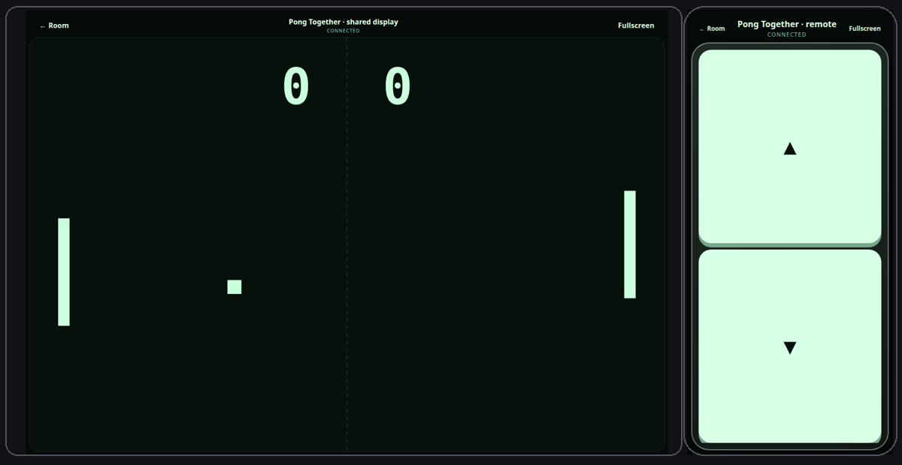

<div align="center">

# Play Together

### Your phone is the console.

A version-isolated multiplayer platform for phone remotes, handheld play, and shared browser/TV displays. Each game ships as an independent cartridge; the platform owns discovery, rooms, pairing, realtime transport, device shells, and immutable release verification.

[](https://github.com/rahmanef63/play-together/actions/workflows/ci.yml)
[](LICENSE)
[](package.json)
[](package.json)

**[Live app](https://game.rahmanef.com)** · [Agent onboarding](docs/agent-onboarding.md) · [Architecture](docs/architecture.md) · [Game SDK](docs/game-sdk.md) · [Submit a game](docs/submitting-games.md) · [Deployment](docs/deployment.md) · [Security](docs/security.md)

</div>

<p align="center">
  
</p>

## Product flow

1. A host creates a room from the generated game registry.
2. **Remote** mode shows a pre-game lobby and QR invite. Phones scan the exact room URL and join as controllers.
3. **Handheld** mode mounts the pinned game display and controls on the same device.
4. The host starts the room. Only then are realtime tickets, game workers, and game frames created.
5. Realtime presence automatically keeps communal games shared or composes per-player games into up to four display viewports.
6. Existing rooms stay pinned to their exact immutable game version and manifest digest.

The platform never decides how a concrete game works. A game never owns QR pairing, split-screen orchestration, Convex auth, or platform navigation.

## Runtime metadata

The live engine has no hardcoded game list or mechanic map. Convex is the playable release/presentation catalog, each immutable manifest owns controller/modules/assets/runtime dependencies, and the frame is a generic verified interpreter. `game-registry.json` exists for tooling/previews only. Large shared browser libraries use versioned engine ABI surfaces such as `three@0.185.1+pt1`, so 3D cartridges stay small without weakening SHA verification.

## Architecture at a glance

```text
apps/web                    browser shell + feature slices + sandboxed game frame
apps/realtime               transient authoritative WebSocket/worker runtime
convex                      durable control plane and public endpoint facades
packages/contracts          wire/manifest/ticket contracts
packages/game-sdk           stable game runtime boundary
packages/browser-runtime    verified browser asset/realtime client runtime
games/<id>                  one isolated game vertical slice
scripts                     release, registry, docs, security and architecture gates
e2e                         user-flow scenario slices + shared support
releases/game-cdn           immutable generated cartridge releases
```

Dependency direction is enforced by `pnpm architecture:check`. Maintained implementation files have a **200-line budget**; split by cohesive ownership instead of adding generic dumping-ground modules.

### Web ownership

`apps/web/src/app` composes providers/routes. User capabilities live under `features/<slice>`, with page composition, model/hooks, components, and styles colocated. Cross-feature primitives belong in `shared`; sandbox/game-frame concerns belong in `frame`. Feature slices must not import sibling feature internals.

### Backend ownership

Public Convex paths stay stable in files such as `convex/rooms.ts` and `convex/templates.ts`; business logic lives in private domain modules. Realtime room state is split into worker lifecycle, client registry/backpressure, and distributed coordination. Public packages export small domain modules through explicit facades.

### Game ownership

Each `games/<id>` folder owns its authoritative server, display renderer, declared controls, runtime assets, and tests. Rich games split internally by real concerns such as `server/model`, `server/combat`, `display/scene`, `display/hud`, or `display/vehicleRenderer` rather than moving game logic into the platform.

## SSOT rules

| Concern | Source of truth |
| --- | --- |
| game identity/controller/presentation | `games/<id>/game.config.json` |
| wire + manifest schemas | `packages/contracts` |
| runtime game interfaces | `packages/game-sdk` |
| durable room/auth/template data | Convex |
| generated portal discovery | `apps/web/public/game-registry.json` |
| immutable executable release | `releases/game-cdn/games/<id>/<version>/manifest.json` + SHA-256 |
| app visual tokens | `apps/web/src/styles/tokens.css` |
| game-frame visual tokens | `apps/web/src/frame/styles/tokens.css` |
| game submission agent prompt | `docs/game-submission-prompt.txt` |
| verification commands | root `package.json` |

Do not add compatibility shims, duplicate APIs, placeholder modules, copied prompt text, game-specific host heuristics, or second registries.

## Quick start

Requirements: Node.js 22+, pnpm 10+, Docker Compose v2, and Chromium/Chrome for E2E.

```bash
git clone https://github.com/rahmanef63/play-together.git
cd play-together
pnpm install
pnpm stack:bootstrap
```

Open `http://localhost:4173`. `stack:bootstrap` creates ignored local secrets, starts self-hosted Convex, publishes discovered game releases, deploys Convex functions, registers manifests, and starts web/realtime services.

Stop without deleting durable local Convex data:

```bash
pnpm stack:down
```

Do not use `docker compose down -v` unless local data should be destroyed intentionally.

## Add or update a game

Read [docs/submitting-games.md](docs/submitting-games.md) and [docs/game-sdk.md](docs/game-sdk.md). The repository exposes bounded MCP/MSO operations (`game.list`, `game.get`, `game.create`, `game.update`, `game.validate`, `game.publish`, `game.registry`, `game.prompt`). Published cartridge bytes are immutable: any byte-changing update requires a greater semantic version.

```bash
pnpm game:publish:one <game-id>
pnpm game:publish:convex:one <game-id>
```

Production registration is performed only by verified `main` CI. Project tools create/validate local releases; they do not bypass deployment gates.

## Verification

```bash
pnpm verify          # lint + architecture + types + tests + builds + smoke + security audit
pnpm verify:stack    # realtime smoke + browser multiplayer E2E
pnpm test:e2e        # 10 end-to-end user scenarios split by capability
pnpm game:previews   # recapture game preview thumbnails from a running stack
```

E2E covers QR join, Start-gated lifecycle, public/private/password admission, remote/handheld surfaces, responsive console shells, independent cartridges, automatic shared/split display, room CRUD, PWA/ops layout, authoritative realtime, and concurrent final-slot admission.

## Production

- Player app + game CDN: Vercel, `https://game.rahmanef.com`
- Realtime: same-origin `/api/realtime`, coordinated across instances through Redis
- Durable control plane/auth: Convex Cloud
- Private commercial template source: private Blob + Convex entitlement

See [docs/deployment.md](docs/deployment.md) before shipping and [docs/security.md](docs/security.md) / [SECURITY.md](SECURITY.md) for trust boundaries.

## Agent sessions

Start with [AGENTS.md](AGENTS.md), then [docs/agent-onboarding.md](docs/agent-onboarding.md). The onboarding guide maps common tasks to their owning slice, lists files that must not become SSOT, and defines the smallest valid verification gate before merge.

## Contributing and license

Contributions follow [CONTRIBUTING.md](CONTRIBUTING.md) and the [Code of Conduct](CODE_OF_CONDUCT.md). Security reports follow [SECURITY.md](SECURITY.md), not public issues.

[MIT](LICENSE) © 2026 rahmanef63
