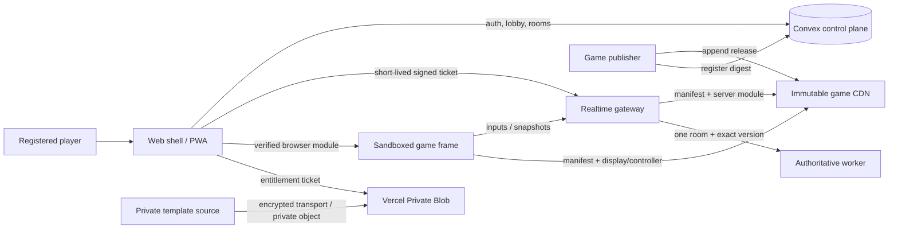

<div align="center">

# Play Together

### Your phone is the console.

A version-isolated multiplayer game platform for **mobile controllers**, **handheld play**, and **shared browser/TV screens** — built so each game can ship independently without coupling the whole platform.

[](https://github.com/rahmanef63/play-together/actions/workflows/ci.yml)
[](LICENSE)
[](package.json)
[](package.json)
[](tsconfig.base.json)

**[Live app](https://game.rahmanef.com)** · [Architecture](docs/architecture.md) · [Game SDK](docs/game-sdk.md) · [Submit a game](docs/submitting-games.md) · [Deployment](docs/deployment.md) · [Security](docs/security.md)

</div>

<p align="center">
  
</p>

> The gameplay above is captured from the real end-to-end test stack: an authoritative shared display on desktop and a live controller on mobile.

## What it does

One multiplayer session can expose different surfaces to different devices:

| Mode | What the player sees | Typical use |
|---|---|---|
| **Remote** | TV/laptop shows a QR join lobby; scanned phones become controllers, then display auto-selects shared or per-player split views after Start | Couch multiplayer, projector, desktop, TV |
| **Handheld console** | Live game screen + controls in one device | Game Boy-style portrait or PSP-style landscape play |

Remote is one device-adaptive experience: TV/laptop-sized devices open a pre-game lobby with a QR code for the exact room, while phones that scan it join as controllers. The host starts the game only after players are ready; no realtime ticket, game worker, or game iframe is created while the room is still in the lobby. Once playing, authoritative realtime presence counts connected Remote controllers and the host registry decides whether the display stays on one communal screen or automatically splits into up to four player-focused views. The display uses one authoritative realtime connection and one verified display module, not one connection/worker per viewport. Handheld mode uses the same Start-gated room lifecycle and then loads the exact pinned release's `display` and controller topology together.

<table>
<tr>
<td width="34%"></td>
<td width="33%"></td>
<td width="33%"></td>
</tr>
<tr>
<td align="center"><b>Remote controller</b></td>
<td align="center"><b>Handheld portrait</b></td>
<td align="center"><b>Handheld landscape</b></td>
</tr>
</table>

## Mobile console shell

The phone console chassis is a platform concern; each cartridge still owns its actual buttons, sticks, gestures, and input semantics. Remote mode is **screenless** and landscape-first, while handheld mode mounts the pinned display and controller together after Start. Face-button `face` metadata may still use A/B/X/Y for physical placement, while an optional per-control `displayLabel` in the immutable game manifest provides semantic text such as BOOST, CANNON, FLAPS, or GEAR. The renderer does not hardcode game/action names. The verified manifest may set `controller.shellPreset` to `classic`, `racing`, or `flight`; older immutable releases remain compatible through a deterministic metadata fallback. The remote chassis is handset-bounded rather than stretched across wide screens and uses `100dvh`, safe-area insets, disabled accidental zoom/scroll, and touch-first sizing for iOS and Android.

### Native PWA shell

On phones the portal uses a safe-area-aware bottom app dock with Home, Rooms, Templates, Submit, and System destinations. Lobby panels, gameplay previews, templates, and launch-mode cards use touch-friendly horizontal snap rails instead of shrinking desktop grids. Native browser scrollbars stay hidden behind application-owned scroll areas. Routes outside the hot gameplay path are lazy-loaded, lists render skeleton placeholders while Convex data is pending, and preview images use lazy async decoding.

The service worker is stamped from the platform semantic version on every build. When a newer version is waiting, the app shows a reload toast that removes only `play-together-*` caches and application-owned version cookies before activating the new worker. **Convex authentication/session state is deliberately preserved.**

## Why the architecture is different

A platform update should not force every game to move together, and a game release should not silently alter an active room.

Play Together therefore separates the platform from game releases:

- **Convex Cloud control plane** — users, authentication, published games, rooms, memberships, capacity, template entitlements, and signed connection/download tickets.
- **Vercel realtime gateway + Redis room bus** — authoritative simulation with cross-Function presence, validated input fan-out, authority snapshots, and room lifecycle. Redis is transient coordination only; Convex remains the durable control plane.
- **Vercel game CDN** — immutable, SHA-256-pinned browser/controller/server bundles served from the static deployment.
- **Vercel web shell / PWA** — registration, lobby, password reset, template marketplace, device-mode selection, and sandbox hosting.
- **Game workers** — one isolated worker per active room, pinned to one exact game release.
- **Games** — depend only on stable contracts/SDKs; platform code never imports a concrete game.

### Version isolation

Every room stores:

```text
gameId
gameVersion
manifestUrl
manifestSha256
```

Publishing `pong@0.3.0` does **not** overwrite `pong@0.2.0`. Existing rooms remain pinned to the previous manifest while new rooms can use the new release. Updating one game does not rebuild or mutate another game.

## Architecture



The latency-sensitive input path never writes each frame to Convex. Convex is the durable control plane; the realtime gateway is the authoritative gameplay plane.

See [docs/architecture.md](docs/architecture.md) for vertical slices, boundaries, and trust assumptions.

## Product flow

1. Register with name, email, and password.
2. Create a public or private room.
3. Add an optional password independently of room visibility.
4. Share the room code or let players discover available public rooms.
5. Choose either **Shared screen + phone remote** or **Handheld console** for the pinned game release.
6. Convex issues a short-lived signed ticket pinned to the room and exact game release.
7. The realtime gateway validates the ticket and starts/reuses the room's authoritative worker.
8. Browser game modules receive only the scoped runtime bridge they need.

<p align="center">
  
</p>

## Repository layout

```text
apps/
  web/                 lobby, room launch, PWA, sandbox host
  realtime/            WebSocket gateway, module cache, room workers
games/
  pong/                classic two-player paddle game
  tap-race/            four-player rapid-tap race
  reaction-rush/       reflex / false-start duel
  memory-lights/       growing four-pad memory sequence
  snake-arena/         multiplayer grid snake
  dodge-dash/          continuous obstacle dodging
  target-blast/        coordinate-based touch aiming
  tug-war/             two-team rapid-input tug of war
  rhythm-pulse/        server-timed rhythm scoring
  maze-run/            server-authoritative grid maze
  stack-tower/         overlap-based timing tower race
  orbit-dodge/         angular movement and meteor avoidance
  turbo-circuit/       3D arcade racing with AI rivals and lap physics
  sky-strike/          3D fighter dogfight with cannon/missiles
  flight-trainer/      3D pilot training, instruments, stall and landing
packages/
  contracts/           versioned wire and manifest schemas
  game-sdk/            stable API allowed inside game implementations
  browser-runtime/     digest verification, iframe protocol, reconnecting WS client
  security/            ticket signing and verification
  emulator-sdk/        lawful-image and emulator adapter contracts
convex/                 auth, catalog, rooms, memberships, tickets
infra/                  game CDN and local Convex issuer bridge
releases/game-cdn/      tracked immutable game release archive
scripts/                discovery, build, publish, bootstrap, security checks
e2e/                    real browser multiplayer scenarios
docs/                   architecture, SDK, deployment, security, emulator roadmap
```

The repository follows a **vertical-slice architecture**. Cross-slice dependencies are checked by `pnpm architecture:check`.

### Included games

| Game | Players | Primary control | Gameplay |
|---|---:|---|---|
| Pong Together | 1–2 | Up / Down | Realtime paddle physics |
| Tap Race | 1–4 | Tap | Button-mashing race |
| Reaction Rush | 1–8 | Hit | Reflex + false-start timing |
| Memory Lights | 1–8 | Four color pads | Growing memory sequence |
| Snake Arena | 1–4 | D-pad | Grid movement, growth, collisions |
| Dodge Dash | 1–4 | Left / Right | Continuous obstacle survival |
| Target Blast | 1–8 | Touch coordinates | Precision target shooting |
| Tug War | 2–8 | Pull | Team input battle |
| Rhythm Pulse | 1–8 | Tap | Server-timed rhythm accuracy |
| Maze Run | 1–4 | D-pad | Authoritative maze race |
| Stack Tower | 1–4 | Drop | Timing and overlap stacking |
| Orbit Dodge | 1–4 | Rotate | Circular movement and meteor avoidance |
| Turbo Circuit | 1–4 | Steering + pedals + nitro | 3D circuit racing, checkpoints, laps, collisions and AI rivals |
| Sky Strike | 1–4 | Flight stick + weapons | 3D dogfight, lock-on, cannon, homing missiles and AI bandits |
| Flight Trainer | 1–4 | Yoke + throttle + systems | 3D takeoff, navigation, instruments, stall/crash and landing training |

Every game ships independent `display` and authoritative `server` bundles; standard controllers are generated from manifest topology, while a custom controller bundle remains optional. Updating one cartridge does not require changing another game or migrating an active room.

#### Real gameplay previews

These thumbnails are captured from the running handheld runtime, not mockups.

<table>
<tr>
<td width="25%"><br/><b>Pong Together</b></td>
<td width="25%"><br/><b>Tap Race</b></td>
<td width="25%"><br/><b>Reaction Rush</b></td>
<td width="25%"><br/><b>Memory Lights</b></td>
</tr>
<tr>
<td><br/><b>Snake Arena</b></td>
<td><br/><b>Dodge Dash</b></td>
<td><br/><b>Target Blast</b></td>
<td><br/><b>Tug War</b></td>
</tr>
<tr>
<td><br/><b>Rhythm Pulse</b></td>
<td><br/><b>Maze Run</b></td>
<td><br/><b>Stack Tower</b></td>
<td><br/><b>Orbit Dodge</b></td>
</tr>
<tr>
<td><br/><b>Turbo Circuit</b></td>
<td><br/><b>Sky Strike</b></td>
<td><br/><b>Flight Trainer</b></td>
<td><b>15 independent cartridges</b><br/>3D games keep renderer code inside their own slices.</td>
</tr>
</table>

## Quick start

### Requirements

- Node.js 22+
- pnpm 10+
- Docker + Compose v2
- Chromium/Chrome for browser E2E tests

```bash
git clone https://github.com/rahmanef63/play-together.git
cd play-together
pnpm install
pnpm stack:bootstrap
```

Open **http://localhost:4173**.

`stack:bootstrap` creates local-only secrets, starts self-hosted Convex, publishes discovered games, deploys Convex functions, registers manifests, and launches the realtime/web stack. Secrets are written to ignored local files and are never printed.

Stop the stack without deleting the durable Convex volume:

```bash
pnpm stack:down
```

> Do not use `docker compose down -v` unless you intentionally want to delete local Convex data.

## Add a game

A game is a self-contained vertical slice:

```text
games/<game-id>/
  game.config.json   # identity + immutable version + controls + host presentation policy
  package.json
  src/display.ts
  src/server.ts
  src/*.test.ts
```

`game.config.json` is the slice SSOT. Standard phone controls are declarative (`stick`, `dpad`, `button`, `touchpad`) and support face buttons A/B/X/Y, shoulders/triggers, zones, keyboard bindings, and stateful actions. Host presentation is also declarative: `presentation.remoteDisplay.mode` is `shared` for communal views or `per-player` when each remote needs its own camera/focus, with `maxViewports` capped at four. Per-player displays use `ctx.playerId` to focus each locally composed viewport. `pnpm game:registry` discovers every slice and generates the portal registry; the portal never hardcodes a game list. A custom `src/controller.ts` is reserved for a future non-builtin renderer and must not coexist with `controller.console.renderer = "builtin"`.

Game code may import only the stable game SDK/contracts boundary.

```bash
pnpm game:publish:one <game-id>
pnpm game:publish:convex:one <game-id>
```

Release rules:

1. Bump the game version.
2. Never mutate an already-published release.
3. Build/test the game independently.
4. Publish versioned bundles and their SHA-256 manifest.
5. Register the immutable manifest in Convex.
6. Existing rooms keep their pinned release.

Read [docs/game-sdk.md](docs/game-sdk.md) and [docs/submitting-games.md](docs/submitting-games.md) before implementing a new game. The submission guide includes a copy-ready base prompt for AI coding agents and the required validation checklist.

### Game MCP and project tools

The repository exposes game lifecycle operations through both `.mcp.json` (stdio MCP) and `.mso/functions.json` (MSO project functions). Run the standalone server with:

```bash
pnpm mcp:game
```

Available operations are `game_list`, `game_get`, `game_create`, `game_update`, `game_delete`, `game_validate`, `game_publish`, `game_registry`, and `game_prompt`. MSO exposes the same capabilities as `game.list`, `game.get`, etc. Create/update/delete are bounded to `games/<id>`; published cartridge bytes cannot be mutated or deleted, while host-only `remoteDisplay`/`maxViewports` metadata may be adjusted without rewriting an immutable release. `game_publish` creates only the local immutable archive. **Production registration is still performed only by verified main-branch CI.**

The live PWA also exposes the canonical guide and one-click full prompt at **`/developers`**. The prompt is generated from `docs/submitting-games.md`, so frontend instructions and repository rules cannot drift independently.

## Sell a game template

The public cartridges in this repository are MIT-licensed. Commercial/private source should therefore live outside Git under ignored `template-sources/<slug>/`, with its own license and checkout URL. Package and upload it to the connected Private Blob store with `pnpm template:pack <slug> --upload`, then publish the generated metadata with `pnpm template:publish <metadata.json>`.

The marketplace is payment-provider agnostic: each template can expose an HTTPS checkout URL, while a signed fulfillment webhook grants the Convex entitlement. Users who buy before registering can claim the pending purchase later with the same email.

## Production topology

The managed target removes the VPS from the runtime path:

| Surface | Production target | Notes |
|---|---|---|
| Player app + game CDN | Vercel | `https://game.rahmanef.com` |
| Realtime | Vercel WebSocket Function | same-origin `/api/realtime` |
| Durable control plane/auth | Convex Cloud | managed cloud/site endpoints |
| Paid template source | Vercel Private Blob | exact-path signed downloads |
| Cross-instance coordinator | Vercel Redis (`sin1`) | required for managed realtime; transient only |

Managed production requires the connected Redis room coordinator. Separate Vercel WebSocket connections may land on different Function instances, so validated controller input, global presence, authority election, and snapshots are relayed through Redis. Only the elected room replica publishes snapshots; Convex remains the durable SSOT and Redis is never used as the game catalog or durable room database.

Password reset is handled by Convex Auth and Resend using the shared sender `official@rahmanef.com`, with a project-specific display name/tag. Paid template source is kept outside this public MIT repository and is delivered only after a Convex entitlement check.

See [docs/deployment.md](docs/deployment.md) and [.env.production.example](.env.production.example).

## Verification

```bash
pnpm verify          # lint + architecture + typecheck + tests + build + smoke + audit
pnpm verify:stack    # realtime smoke + full browser multiplayer E2E
pnpm game:previews   # recapture all gameplay preview thumbnails from the running stack
pnpm stack:config    # validate merged Docker Compose config
```

The E2E suite covers:

- registration and sessions;
- public/private rooms;
- optional room passwords;
- public available-slot discovery;
- QR Remote join, Start-gated room lifecycle, authoritative connected-controller presence, and automatic shared/split display transitions;
- playable handheld screen + controls in portrait and landscape layouts;
- independently loaded games/controllers;
- authoritative WebSocket state;
- transactional final-slot contention.

The README media is captured from the same running integration stack.

For an already-deployed environment, set `E2E_BASE_URL` and `E2E_REALTIME_HEALTH_URL` to run the same browser scenarios against public HTTPS/WSS infrastructure.

## Security model

Important controls include:

- exact browser origin allowlists;
- PBKDF2 password hashing with per-secret salts plus a 12-character strong-password policy for new/reset passwords;
- enumeration-safe, rate-limited password reset through Resend;
- transactional room capacity;
- expiring HMAC-signed connection tickets;
- ticket replay protection;
- input schema validation and rate limiting;
- immutable SHA-256-pinned game modules;
- sandboxed browser game frames;
- a dedicated worker for each active room/version;
- private template entitlements with short-lived signed Blob downloads;
- no committed production credentials.

Game server bundles are **trusted publisher code**. Worker threads provide runtime isolation and lifecycle containment, but they are not a hostile-code sandbox. Untrusted third-party server modules require a stronger container/microVM boundary.

See [docs/security.md](docs/security.md) and [SECURITY.md](SECURITY.md).

## Emulator foundation

`packages/emulator-sdk` provides a future boundary for browser/server emulator adapters, controller mapping, capability detection, save states, and lawful game-image metadata.

The repository intentionally ships **no ROMs, BIOS/firmware, copyrighted game images, or emulator cores**. PS1/PS2 compatibility must be evaluated per core, browser, device, and legally supplied game image.

See [docs/emulator-roadmap.md](docs/emulator-roadmap.md).

## Contributing

Contributions are welcome. Start with [CONTRIBUTING.md](CONTRIBUTING.md), follow the [Code of Conduct](CODE_OF_CONDUCT.md), and keep game/platform boundaries intact.

For vulnerabilities, follow [SECURITY.md](SECURITY.md) rather than opening a public issue.

## License

[MIT](LICENSE) © 2026 rahmanef63
