<div align="center">

# Play Together

### Your phone is the console.

A version-isolated multiplayer game platform for **mobile controllers**, **handheld play**, and **shared browser/TV screens** — built so each game can ship independently without coupling the whole platform.

[](https://github.com/rahmanef63/play-together/actions/workflows/ci.yml)
[](LICENSE)
[](package.json)
[](package.json)
[](tsconfig.base.json)

**[Live app](https://game.rahmanef.com)** · [Architecture](docs/architecture.md) · [Game SDK](docs/game-sdk.md) · [Deployment](docs/deployment.md) · [Security](docs/security.md)

</div>

<p align="center">
  
</p>

> The gameplay above is captured from the real end-to-end test stack: an authoritative shared display on desktop and a live controller on mobile.

## What it does

One multiplayer session can expose different surfaces to different devices:

| Mode | What the player sees | Typical use |
|---|---|---|
| **Shared screen + phone remote** | Authoritative game on browser/TV + controls on the current phone | Couch multiplayer, projector, desktop, TV |
| **Handheld console** | Live game screen + controls in one device | Game Boy-style portrait or PSP-style landscape play |

The launch UI treats the shared screen and phone remote as one experience. Handheld mode loads the exact pinned release's `display` and `controller` modules together over one realtime connection, so the phone is a complete playable console rather than a detached button panel. The game manifest still decides supported modes and orientation.

<table>
<tr>
<td width="34%">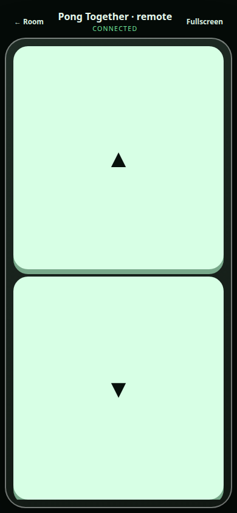</td>
<td width="33%">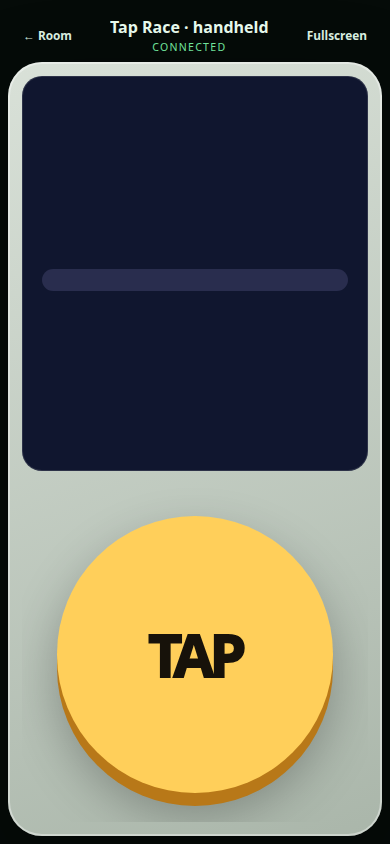</td>
<td width="33%">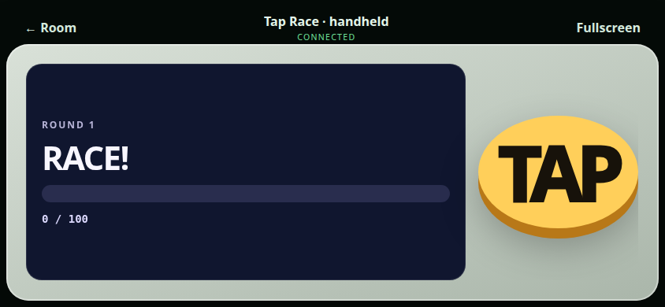</td>
</tr>
<tr>
<td align="center"><b>Remote controller</b></td>
<td align="center"><b>Handheld portrait</b></td>
<td align="center"><b>Handheld landscape</b></td>
</tr>
</table>

## Mobile console shell

The phone console chassis is a platform concern; each cartridge still owns its actual buttons, sticks, gestures, and input semantics. Remote mode is **screenless** and landscape-first, while handheld mode mounts the pinned display and controller together. The verified manifest may set `controller.shellPreset` to `classic`, `racing`, or `flight`; older immutable releases remain compatible through a deterministic metadata fallback. The shell uses `100dvh`, safe-area insets, disabled accidental zoom/scroll, and touch-first sizing for iOS and Android.

## Why the architecture is different

A platform update should not force every game to move together, and a game release should not silently alter an active room.

Play Together therefore separates the platform from game releases:

- **Convex control plane** — users, authentication, published games, rooms, memberships, capacity, and signed connection tickets.
- **Realtime gateway** — transient input, authoritative simulation, snapshots, presence, validation, and room lifecycle.
- **Game CDN** — immutable, SHA-256-pinned browser/controller/server bundles.
- **Web shell / PWA** — registration, lobby, private-room entry, device-mode selection, and sandbox hosting.
- **Game workers** — one isolated worker per active room, pinned to one exact game release.
- **Games** — depend only on stable contracts/SDKs; platform code never imports a concrete game.

### Version isolation

Every room stores:

```text
gameId
gameVersion
manifestUrl
manifestSha256
```

Publishing `pong@0.3.0` does **not** overwrite `pong@0.2.0`. Existing rooms remain pinned to the previous manifest while new rooms can use the new release. Updating one game does not rebuild or mutate another game.

## Architecture

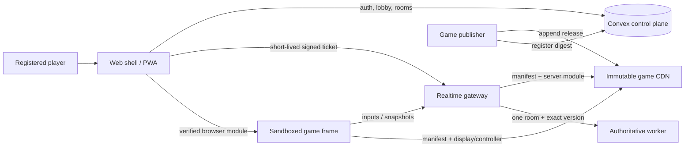

The latency-sensitive input path never writes each frame to Convex. Convex is the durable control plane; the realtime gateway is the authoritative gameplay plane.

See [docs/architecture.md](docs/architecture.md) for vertical slices, boundaries, and trust assumptions.

## Product flow

1. Register with name, email, and password.
2. Create a public or private room.
3. Add an optional password independently of room visibility.
4. Share the room code or let players discover available public rooms.
5. Choose either **Shared screen + phone remote** or **Handheld console** for the pinned game release.
6. Convex issues a short-lived signed ticket pinned to the room and exact game release.
7. The realtime gateway validates the ticket and starts/reuses the room's authoritative worker.
8. Browser game modules receive only the scoped runtime bridge they need.

<p align="center">
  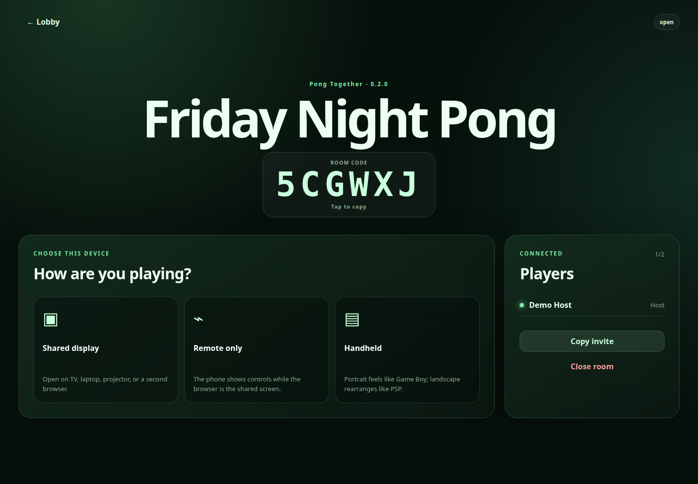
</p>

## Repository layout

```text
apps/
  web/                 lobby, room launch, PWA, sandbox host
  realtime/            WebSocket gateway, module cache, room workers
games/
  pong/                classic two-player paddle game
  tap-race/            four-player rapid-tap race
  reaction-rush/       reflex / false-start duel
  memory-lights/       growing four-pad memory sequence
  snake-arena/         multiplayer grid snake
  dodge-dash/          continuous obstacle dodging
  target-blast/        coordinate-based touch aiming
  tug-war/             two-team rapid-input tug of war
  rhythm-pulse/        server-timed rhythm scoring
  maze-run/            server-authoritative grid maze
  stack-tower/         overlap-based timing tower race
  orbit-dodge/         angular movement and meteor avoidance
  turbo-circuit/       3D arcade racing with AI rivals and lap physics
  sky-strike/          3D fighter dogfight with cannon/missiles
  flight-trainer/      3D pilot training, instruments, stall and landing
packages/
  contracts/           versioned wire and manifest schemas
  game-sdk/            stable API allowed inside game implementations
  browser-runtime/     digest verification, iframe protocol, reconnecting WS client
  security/            ticket signing and verification
  emulator-sdk/        lawful-image and emulator adapter contracts
convex/                 auth, catalog, rooms, memberships, tickets
infra/                  game CDN and local Convex issuer bridge
releases/game-cdn/      tracked immutable game release archive
scripts/                discovery, build, publish, bootstrap, security checks
e2e/                    real browser multiplayer scenarios
docs/                   architecture, SDK, deployment, security, emulator roadmap
```

The repository follows a **vertical-slice architecture**. Cross-slice dependencies are checked by `pnpm architecture:check`.

### Included games

| Game | Players | Primary control | Gameplay |
|---|---:|---|---|
| Pong Together | 1–2 | Up / Down | Realtime paddle physics |
| Tap Race | 1–4 | Tap | Button-mashing race |
| Reaction Rush | 1–8 | Hit | Reflex + false-start timing |
| Memory Lights | 1–8 | Four color pads | Growing memory sequence |
| Snake Arena | 1–4 | D-pad | Grid movement, growth, collisions |
| Dodge Dash | 1–4 | Left / Right | Continuous obstacle survival |
| Target Blast | 1–8 | Touch coordinates | Precision target shooting |
| Tug War | 2–8 | Pull | Team input battle |
| Rhythm Pulse | 1–8 | Tap | Server-timed rhythm accuracy |
| Maze Run | 1–4 | D-pad | Authoritative maze race |
| Stack Tower | 1–4 | Drop | Timing and overlap stacking |
| Orbit Dodge | 1–4 | Rotate | Circular movement and meteor avoidance |
| Turbo Circuit | 1–4 | Steering + pedals + nitro | 3D circuit racing, checkpoints, laps, collisions and AI rivals |
| Sky Strike | 1–4 | Flight stick + weapons | 3D dogfight, lock-on, cannon, homing missiles and AI bandits |
| Flight Trainer | 1–4 | Yoke + throttle + systems | 3D takeoff, navigation, instruments, stall/crash and landing training |

Every game ships independent `display`, `controller`, and authoritative `server` bundles. Updating one cartridge does not require changing another game or migrating an active room.

#### Real gameplay previews

These thumbnails are captured from the running handheld runtime, not mockups.

<table>
<tr>
<td width="25%">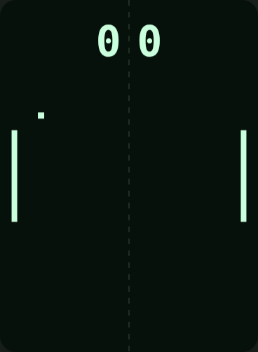<br/><b>Pong Together</b></td>
<td width="25%">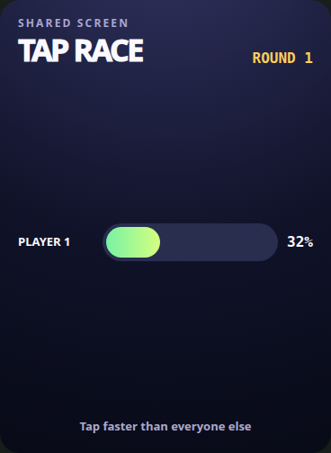<br/><b>Tap Race</b></td>
<td width="25%">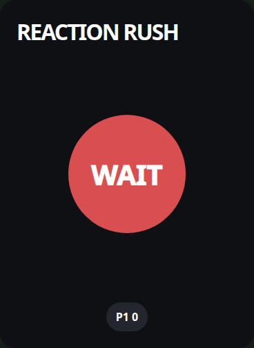<br/><b>Reaction Rush</b></td>
<td width="25%">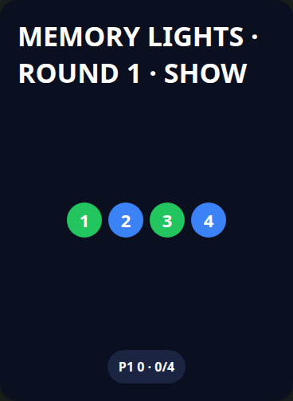<br/><b>Memory Lights</b></td>
</tr>
<tr>
<td>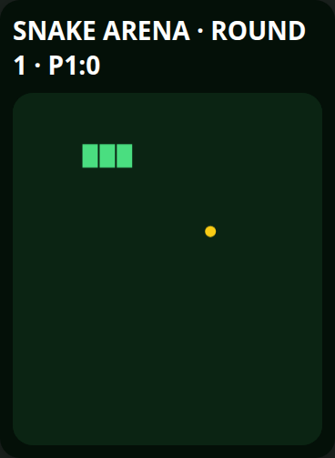<br/><b>Snake Arena</b></td>
<td>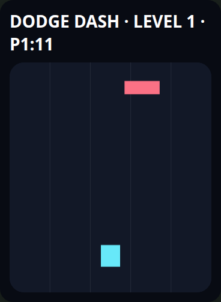<br/><b>Dodge Dash</b></td>
<td>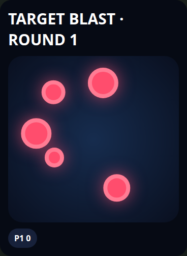<br/><b>Target Blast</b></td>
<td>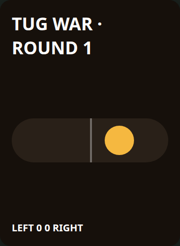<br/><b>Tug War</b></td>
</tr>
<tr>
<td>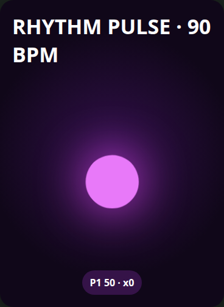<br/><b>Rhythm Pulse</b></td>
<td>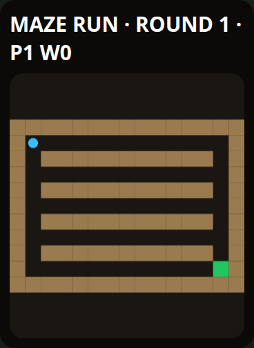<br/><b>Maze Run</b></td>
<td>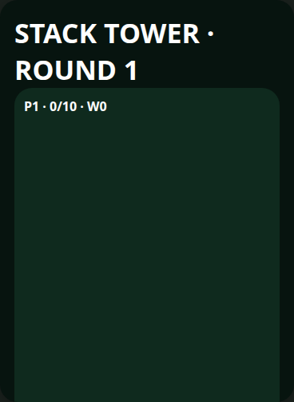<br/><b>Stack Tower</b></td>
<td>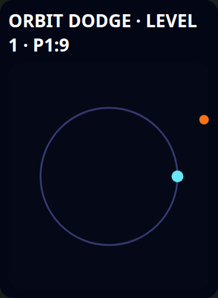<br/><b>Orbit Dodge</b></td>
</tr>
<tr>
<td>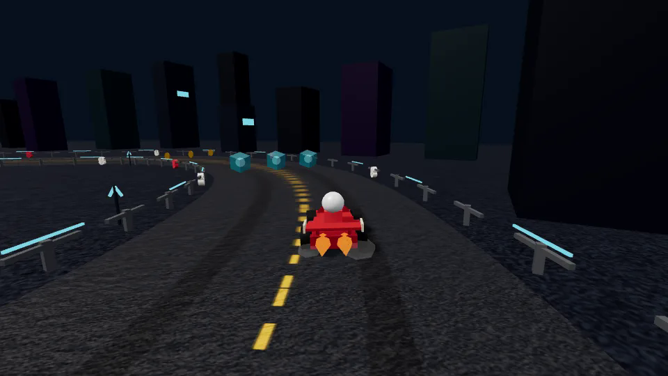<br/><b>Turbo Circuit</b></td>
<td>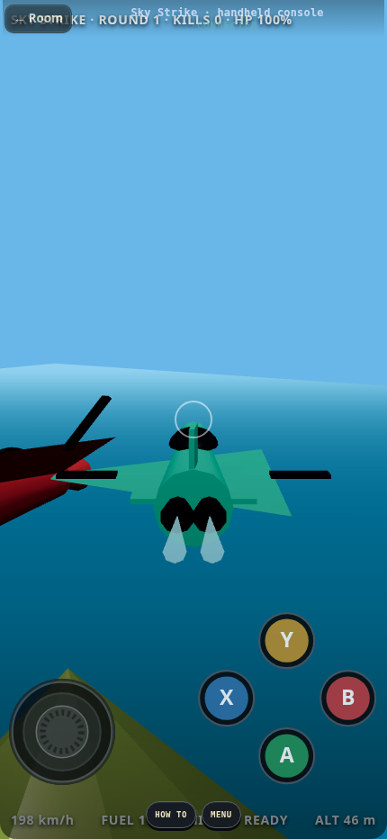<br/><b>Sky Strike</b></td>
<td>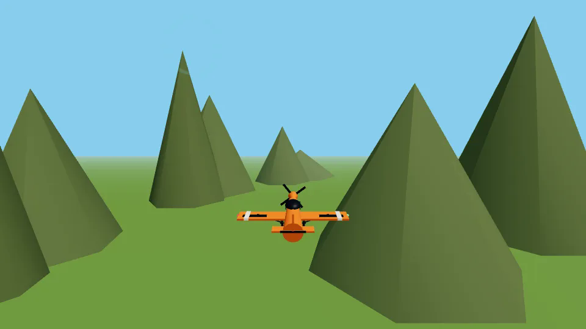<br/><b>Flight Trainer</b></td>
<td><b>15 independent cartridges</b><br/>3D games keep renderer code inside their own slices.</td>
</tr>
</table>

## Quick start

### Requirements

- Node.js 22+
- pnpm 10+
- Docker + Compose v2
- Chromium/Chrome for browser E2E tests

```bash
git clone https://github.com/rahmanef63/play-together.git
cd play-together
pnpm install
pnpm stack:bootstrap
```

Open **http://localhost:4173**.

`stack:bootstrap` creates local-only secrets, starts self-hosted Convex, publishes discovered games, deploys Convex functions, registers manifests, and launches the realtime/web stack. Secrets are written to ignored local files and are never printed.

Stop the stack without deleting the durable Convex volume:

```bash
pnpm stack:down
```

> Do not use `docker compose down -v` unless you intentionally want to delete local Convex data.

## Add a game

A game is a self-contained vertical slice:

```text
games/<game-id>/
  game.config.json
  src/display.ts
  src/controller.ts
  src/server.ts
```

Game code may import only the stable game SDK/contracts boundary.

```bash
pnpm game:publish:one <game-id>
pnpm game:publish:convex:one <game-id>
```

Release rules:

1. Bump the game version.
2. Never mutate an already-published release.
3. Build/test the game independently.
4. Publish versioned bundles and their SHA-256 manifest.
5. Register the immutable manifest in Convex.
6. Existing rooms keep their pinned release.

Read [docs/game-sdk.md](docs/game-sdk.md) before implementing a new game.

## Production topology

The reference production deployment uses `game.rahmanef.com` as the player-facing entry point while keeping service boundaries independently routable:

| Surface | Production endpoint | Service |
|---|---|---|
| Player app | `https://game.rahmanef.com` | web shell / PWA |
| Realtime | `wss://rt-game.rahmanef.com/v1/connect` | authoritative gateway |
| Game releases | `https://games-game.rahmanef.com` | immutable game CDN |
| Convex API | `https://api-game.rahmanef.com` | Convex API/WebSocket |
| Convex auth/site | `https://site-game.rahmanef.com` | Convex HTTP actions/auth |

The Convex dashboard is intentionally **not public**. Production uses a distinct Compose project name (`play-together-prod`) so it cannot collide with a local developer stack.

See [docs/deployment.md](docs/deployment.md) and [.env.production.example](.env.production.example).

## Verification

```bash
pnpm verify          # lint + architecture + typecheck + tests + build + smoke + audit
pnpm verify:stack    # realtime smoke + full browser multiplayer E2E
pnpm game:previews   # recapture all gameplay preview thumbnails from the running stack
pnpm stack:config    # validate merged Docker Compose config
```

The E2E suite covers:

- registration and sessions;
- public/private rooms;
- optional room passwords;
- public available-slot discovery;
- combined shared-screen + phone-remote launch flow;
- playable handheld screen + controls in portrait and landscape layouts;
- independently loaded games/controllers;
- authoritative WebSocket state;
- transactional final-slot contention.

The README media is captured from the same running integration stack.

For an already-deployed environment, set `E2E_BASE_URL` and `E2E_REALTIME_HEALTH_URL` to run the same browser scenarios against public HTTPS/WSS infrastructure.

## Security model

Important controls include:

- exact browser origin allowlists;
- PBKDF2 password hashing with per-secret salts;
- transactional room capacity;
- expiring HMAC-signed connection tickets;
- ticket replay protection;
- input schema validation and rate limiting;
- immutable SHA-256-pinned game modules;
- sandboxed browser game frames;
- a dedicated worker for each active room/version;
- no committed production credentials.

Game server bundles are **trusted publisher code**. Worker threads provide runtime isolation and lifecycle containment, but they are not a hostile-code sandbox. Untrusted third-party server modules require a stronger container/microVM boundary.

See [docs/security.md](docs/security.md) and [SECURITY.md](SECURITY.md).

## Emulator foundation

`packages/emulator-sdk` provides a future boundary for browser/server emulator adapters, controller mapping, capability detection, save states, and lawful game-image metadata.

The repository intentionally ships **no ROMs, BIOS/firmware, copyrighted game images, or emulator cores**. PS1/PS2 compatibility must be evaluated per core, browser, device, and legally supplied game image.

See [docs/emulator-roadmap.md](docs/emulator-roadmap.md).

## Contributing

Contributions are welcome. Start with [CONTRIBUTING.md](CONTRIBUTING.md), follow the [Code of Conduct](CODE_OF_CONDUCT.md), and keep game/platform boundaries intact.

For vulnerabilities, follow [SECURITY.md](SECURITY.md) rather than opening a public issue.

## License

[MIT](LICENSE) © 2026 rahmanef63
