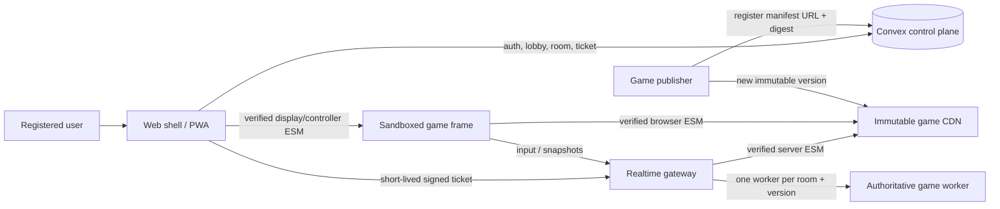

# Play Together

A version-isolated multiplayer game platform where a phone can be the entire handheld console, a remote controller for a shared browser display, or both.

Play Together separates durable product data from latency-sensitive gameplay:

- **Convex** owns users, authentication, the published-game catalog, rooms, memberships, capacity, and signed connection tickets.
- **Realtime Gateway** owns transient input, authoritative simulation, snapshots, presence, and one isolated worker per active room.
- **Game CDN** serves immutable, SHA-256-pinned display, controller, and server bundles.
- **Web Shell** owns registration, the public lobby, private room entry, device-mode selection, and the sandboxed game frame.
- **Games** depend only on the stable SDK/contracts. The platform never imports a concrete game.

## Product flow

1. Register with name, email, and password.
2. Create a room or join a public room with an available slot.
3. Make a room public or private; either kind may have an optional password.
4. Pick a device mode declared by the selected game:
   - **Remote only** — phone controls a shared browser screen.
   - **Handheld** — phone renders its own game screen and controls; portrait and landscape may use different layouts.
   - **Shared display** — browser/TV renders the authoritative room state.
5. Convex issues a short-lived signed ticket pinned to the room's exact game version and manifest digest.
6. The gateway validates the ticket, downloads and verifies the server bundle, and runs it in a dedicated worker.

## Architecture



A room stores `gameId`, `gameVersion`, `manifestUrl`, and `manifestSha256`. Existing rooms remain pinned when a new game version is published. A new release therefore does not rebuild the web shell, change another game, or silently migrate an active room.

## Repository layout

```text
apps/
  web/                 lobby, room launch, PWA, sandbox host
  realtime/            WebSocket gateway, module cache, room workers
games/
  pong/                two-player reference game
  tap-race/            four-player reference game with a different console
packages/
  contracts/           versioned wire and manifest schemas
  game-sdk/            only runtime dependency allowed for game implementations
  browser-runtime/     digest verification, iframe protocol, reconnecting WS client
  security/            ticket signing and verification
  emulator-sdk/        lawful-image and emulator adapter contracts
convex/                 auth, game catalog, rooms, memberships, tickets
infra/                  game CDN container
releases/game-cdn/      tracked immutable release archive
scripts/                game discovery/build/publish, bootstrap, checks
```

See [docs/architecture.md](docs/architecture.md) for vertical slices and trust boundaries.

## Local start

Requirements: Node.js 22+, pnpm 10+, Docker with Compose v2, and Chromium/Chrome for E2E tests.

```bash
pnpm install
pnpm stack:bootstrap
```

Open `http://localhost:4173`. The bootstrap command:

- generates local secrets without printing them;
- builds and publishes every discovered `games/*` release;
- starts self-hosted Convex, its local issuer-discovery bridge, its dashboard, and the game CDN on loopback only;
- syncs Convex function environment variables;
- deploys the Convex schema/functions;
- registers all game manifests;
- starts the realtime gateway and web shell.

Stop containers without deleting the Convex volume:

```bash
pnpm stack:down
```

## Verification

```bash
pnpm verify          # lint, boundaries, types, tests, build, realtime smoke, security
pnpm verify:stack    # live gateway smoke + Playwright browser scenarios
pnpm stack:config    # validates merged local Compose configuration
```

The browser suite covers registration, public/private rooms, optional passwords, shared display, remote/handheld modes, portrait/landscape behavior, two independently loaded games, and concurrent joins for the final room slot.

## Add and release a game

Create `games/<game-id>/game.config.json` plus `src/display.ts`, `src/controller.ts`, and `src/server.ts`. A game may import only `@play-together/game-sdk` and `@play-together/contracts`.

```bash
pnpm game:publish:one <game-id>
pnpm game:publish:convex:one <game-id>
```

For a release:

1. Bump `game.version`; never overwrite an existing version.
2. Build and test the game.
3. Publish its immutable files to the tracked release archive and game CDN.
4. Register the manifest URL and SHA-256 digest in Convex.
5. New rooms use the new version; existing rooms continue with their pinned version.

Read [docs/game-sdk.md](docs/game-sdk.md) before adding a game.

## Deployment units

Production is intentionally split into independent units from the same repository:

1. `apps/web/Dockerfile`
2. `apps/realtime/Dockerfile`
3. `infra/game-cdn/Dockerfile`
4. self-hosted Convex backend + schema deployment

The Convex dashboard must not be public. The base `docker-compose.yml` exposes only internal service ports; `docker-compose.local.yml` adds loopback bindings for development. See [docs/deployment.md](docs/deployment.md).

## Emulator direction

`packages/emulator-sdk` defines the boundary for future emulator-backed games without shipping firmware, BIOS, copyrighted game images, or emulator cores. Compatibility is a per-core, per-browser, per-device capability decision—not a platform promise. See [docs/emulator-roadmap.md](docs/emulator-roadmap.md).

## Security

The main controls are exact origin allowlists, PBKDF2 password storage, transactional room capacity, HMAC-signed expiring tickets, replay protection, input schemas and rate limits, immutable digest-pinned modules, a sandboxed browser frame, and a worker per room. Game server bundles are trusted publisher code; third-party untrusted server code requires a stronger container or microVM boundary. See [docs/security.md](docs/security.md) and [SECURITY.md](SECURITY.md).
